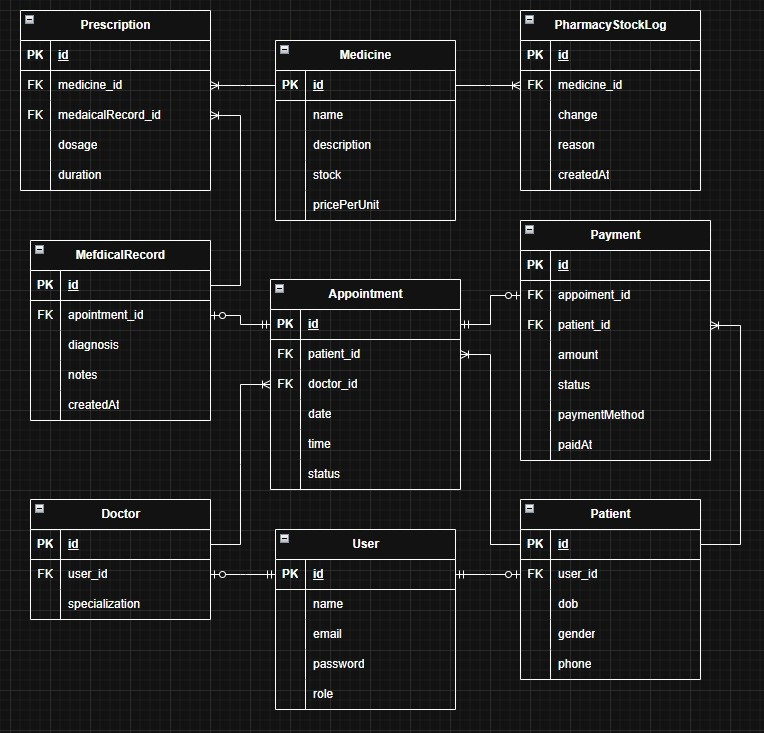

# CC20 My-Project (PoRPaI Health Care System) BACKEND

## สรุป ER-DIAGRAM

#### 1. ระบบผู้ใช้งาน (User System)

• ทุก ID ใช้ตาราง User ร่วมกัน (admin,doctor,patient)  
• แยกข้อมูลเพิ่มเติมของหมอและคนไข้ตามตาราง doctor และ patient  
• Admin เป็นคนสร้าง ID ของ doctor เท่านั้น  
• patientId ลูกค้าเป็นคนสร้างเองหรือ admin สร้างให้  
• login => ตรวจ role => ไปหน้า dashboard ตามสิทธิ์

#### 2. ระบบนัดหมาย (Appointment Flow)

• Admin ลงเวลาจองนัดระหว่างคนไข้และหมอ  
• หมอดูรายการนัดหมายของคนไข้ตัวเองได้ทั้งหมด  
• ทุก AppointmentId จะเชื่อมโยงกับ PatientId และ DoctorId

#### 3. ระบบวินิจฉัยและสั่งยา (Medical Record & Prescription)

• หมอเป็นคนบันทึก Medical Record  
• จากนั้นจึงสั่งยาผ่าน Prescription (สามารถสั่งหลายรายการต่อ 1 Medical Record ได้)

- แต่ละ Prescription จะระบุ medicineId,dosage,duration

#### 4. ระบบจัดการยา (Medicine & PharmacyStockLog)

• Medicine คือรายการยาทั้งหมดของโรงพยาบาล  
• มี stock และ pricePerUnit กำกับอยู่  
• ทุกครั้งที่มีการเพิ่มหรือลดยา จะต้องบันทึกใน PharmacyStockLog เพื่อข่วยให้ตรวจสอบได้

#### 5. ระบบชำระเงิน (Payment System)

• หลังการรักษา => ระบบคำนวณยอดชำระ  
• สร้างรายการใน Payment เชื่อมกับ appointmentId โดยมี amount,paymentMethod,paidAt,status  
• ผู้ป่วยสามารถดูสถานะทางการเงินของตนเองได้

## Role-based Access Suggestion

| Role    | Access                                             |
| :------ | :------------------------------------------------- |
| Patient | Get only own appointment and payment               |
| Doctor  | Create own medical record and prescription patient |
| Admin   | Manage everything include register doctorId        |

## All Path for my project

#### Auth Path

| path                            | method | authen | params | query | body                                                 | response                                                                     | Description        |
| :------------------------------ | :----- | :----- | :----- | :---- | :--------------------------------------------------- | :--------------------------------------------------------------------------- | :----------------- |
| /api/auth/login                 | POST   | -      | -      | -     | {email,password}                                     | {message: "Login success, Welcome back ${firstName + lastName},accessToken"} | Login              |
| /api/auth/register/doctor       | POST   | admin  | -      | -     | {firstName,lastName,email,password,specialization}   | {message: "Register success, Welcome ${firstName + lastName}"}               | Doctor's register  |
| /api/auth/register/patient      | POST   | -      | -      | -     | {firstName,lastName,email,password,dob,gender,phone} | {message: "Register success, Welcome ${firstName + lastName}"}               | Patient's register |
| /api/auth/me                    | GET    | user   | -      | -     | -                                                    | {message:"This is ${firstName + lastName}, Your role is ${role}"}            | Get user           |
| /api/auth/forgot-password       | POST   | -      | -      | -     | {email}                                              | {message: "Reset link",link}                                                 | Forgot password    |
| /api/auth/reset-password/:token | POST   | -      | token  | -     | {password}                                           | {message: "Reset password success}                                           | Reset password     |
| /api/auth/publicDoctor          | GET    | -      | -      | -     | -                                                    | {doctors:[ ]}                                                                | Get public doctor  |

#### Doctor Path

| path                   | method | authen | params   | query | body                                      | response                                            | Description              |
| :--------------------- | :----- | :----- | :------- | :---- | :---------------------------------------- | :-------------------------------------------------- | :----------------------- |
| /api/doctors           | GET    | admin  | -        | -     | -                                         | {allDoctors:[ ]}                                    | Get all doctors          |
| /api/doctors/:doctorId | GET    | admin  | doctorId | -     | -                                         | {doctor:{ }}                                        | Get doctor by id         |
| /api/doctors/:doctorId | PUT    | admin  | doctorId | -     | {firstName,lastName,email,specialization} | {message:"Update information success"}              | Update doctor by id      |
| /api/doctors/:doctorId | PATCH  | admin  | doctorId | -     | {deletedAt: new Date()}                   | {message:"${firstName + lastName} has been deleted} | Soft delete doctor by id |

#### Patient Path

| path                     | method | authen | params    | query | body                             | response                                                  | Description               |
| :----------------------- | :----- | :----- | :-------- | :---- | :------------------------------- | :-------------------------------------------------------- | :------------------------ |
| /api/patients            | GET    | admin  | -         | -     | -                                | {allPatients:[ ]}                                         | Get all patients          |
| /api/patients/:patientId | GET    | admin  | patientId | -     | -                                | {Patient:{ }}                                             | Get patient by id         |
| /api/patients/:patientId | PUT    | admin  | patientId | -     | {firstName,lastName,email,phone} | {message:"Update ${firstName + lastName} inform success"} | Update patient by id      |
| /api/patients/patientId  | PATCH  | admin  | patientId | -     | {deletedAt: new Date()}          | {message:"Soft delete ${firstName + lastName} success}    | Soft delete patient by id |

#### Appointment Path

| path                       | method | authen  | params | query | body                            | response                                                      | Description                       |
| :------------------------- | :----- | :------ | :----- | :---- | :------------------------------ | :------------------------------------------------------------ | :-------------------------------- |
| /api/appointments          | GET    | admin   | -      | -     | -                               | {allAppointments: [ ]}                                        | Get all appointments              |
| /api/appointments/:id      | GET    | admin   | id     | -     | -                               | {appointments: [ ]}                                           | Get appointment by id             |
| /api/appointments/doctors  | GET    | doctor  | -      | -     | -                               | {appointmentsByDoctorId: [ ]}                                 | Get appointment by doctorId       |
| /api/appointments/patients | GET    | patient | -      | -     | -                               | {appointmentsByPatientId: [ ]}                                | Get appointment by patientId      |
| /api/appointments          | POST   | admin   | -      | -     | {date,time,doctorId,patientId}  | {message: "Create appointment success",doctorName,clientName} | Create appointment                |
| /api/appointments/:id      | DELETE | admin   | id     | -     | -                               | {message: "Cancel appointment success"}                       | Cancel appointment by id          |
| /api/appointments/:id      | PUT    | admin   | id     | -     | {date,timed,doctorId,patientId} | {message:"Change appointment schedule success"}               | Change schedule appointment by id |
| /api/appointments/:id      | PATCH  | admin   | id     | -     | {status}                        | {message: "Update appointment status success}                 | Update status appointment by id   |

#### Medical Path

| path                          | method | authen  | params | query | body                            | response                                               | Description                           |
| :---------------------------- | :----- | :------ | :----- | :---- | :------------------------------ | :----------------------------------------------------- | :------------------------------------ |
| /api/medical-records          | GET    | admin   | -      | -     | -                               | {allMedicalRecords: [ ]}                               | Get all medical records               |
| /api/medical-records/:id      | GET    | admin   | id     | -     | -                               | {medicalRecord: { }}                                   | Get medical record by id              |
| /api/medical-records          | POST   | doctor  | -      | -     | {diagnosis,notes,appointmentId} | {message: "create medical-record in ${appointmentId}"} | Create medical-record                 |
| /api/medical-records/doctors  | GET    | doctor  | -      | -     | -                               | {allAppointmentInDoctorId : [ ]}                       | Get all medical records in doctor id  |
| /api/medical-records/patients | GET    | patient | -      | -     | -                               | {allAppointmentInPatientId : [ ]}                      | Get all medical records in patient id |

### Prescription Path

| path                                | method | authen | params   | query | body                                          | response                                 | Description                       |
| :---------------------------------- | :----- | :----- | :------- | :---- | :-------------------------------------------- | :--------------------------------------- | :-------------------------------- |
| /api/prescriptions                  | GET    | admin  | -        | -     | -                                             | {allPrescriptions: [ ]}                  | Get all prescriptions             |
| /api/prescriptions/:id              | GET    | admin  | id       | -     | -                                             | {prescription: { }}                      | Get prescription by id            |
| /api/prescriptions                  | POST   | doctor | id       | -     | {dosage,duration,medicalReocordId,medicineId} | {message: "Create prescription success"} | Create new presciption            |
| /api/prescriptions/doctor/:doctorId | GET    | doctor | doctorId | -     | -                                             | {allPrescriptionInDoctorId: [ ]}         | Get all prescription in doctor id |
| /api/prescriptions/:id              | DELETE | doctor | id       | -     | -                                             | {message: "Delete prescription success}  | Delete prescription by id         |

### Medicine Path

| path               | method | authen | params | query | body                                       | response                            | Description           |
| :----------------- | :----- | :----- | :----- | :---- | :----------------------------------------- | :---------------------------------- | :-------------------- |
| /api/medicines     | GET    | admin  | -      | -     | -                                          | {message: allMedicines: [ ]}        | Get all Medicines     |
| /api/medicines/:id | GET    | admin  | id     | -     | -                                          | {message: medicine: { }}            | Get medicine by id    |
| /api/medicines     | POST   | admin  | -      | -     | {name,description,stock,pricePerUnit,form} | {message:"Create medicine success"} | Create new medicine   |
| /api/medicines/:id | PUT    | admin  | id     | -     | {name,description,stock,pricePerUnit,form} | {message:"Update medicine success}  | Update medicine by id |

### Pharmacy Stock Log

| path                          | method | authen | params | query | body                       | response                                      | Description       |
| :---------------------------- | :----- | :----- | :----- | :---- | :------------------------- | :-------------------------------------------- | :---------------- |
| /api/stock-logs/medicines/:id | GET    | admin  | id     | -     | -                          | {pharmacyStocks: [ ]}                         | Get all stock log |
| /api/stock-logs               | POST   | admin  | id     | -     | {change,reason,medicineId} | {message: ${medicineId} stock create success} | Create stock log  |

### Payment

| path                  | method | authen  | params | query | body                                           | response                            | Description                     |
| :-------------------- | :----- | :------ | :----- | :---- | :--------------------------------------------- | :---------------------------------- | :------------------------------ |
| /api/payments         | GET    | admin   | -      | -     | -                                              | {allPayments: [ ]}                  | Get all payment                 |
| /api/payments/:id     | GET    | admin   | id     | -     | -                                              | {payment: { }}                      | Get payment by id               |
| /api/payments         | POST   | admin   | -      | -     | {amount,paymentMethod,patientId,appointmentId} | -                                   | Create payment                  |
| /api/payments/:id     | PATCH  | admin   | id     | -     | {status}                                       | {message: "Update payment success"} | Cancel or update payment status |
| /api/payments/patient | GET    | patient | -      | -     | -                                              | {allPatmentsInPatientId: [ ]}       | Get all payment in patient id   |
